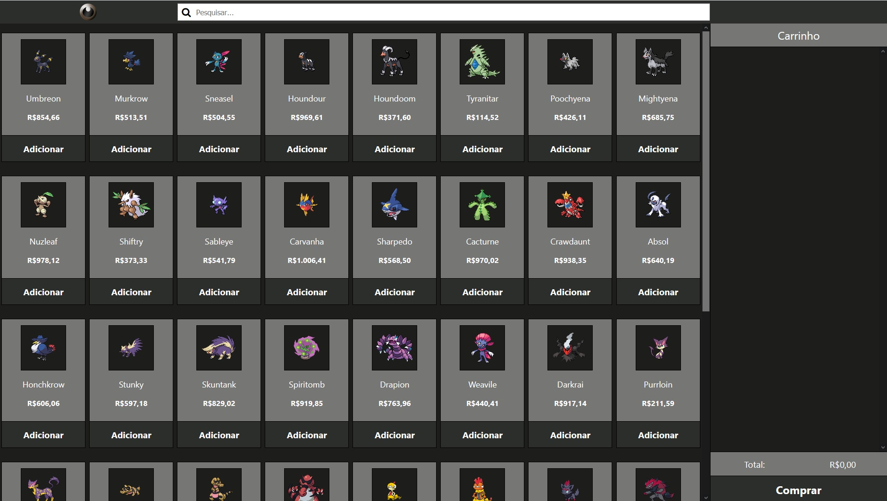

# PokeShop

Bem-vindo ao repositório do código do pokéShop, onde se encontra o código das suas lojas de pokemon online! 

Estas lojas foram feitas utilizando a biblioteca React e todas possuem a mesma base de código, apenas utilizando variáveis de ambiente para modificá-las, fazendo com que seja fácil manter as lojas e construir novas! ( para caso a GameFreak resolva inventar mais um tipo além de fada ...) 

Possuímos 3 tipos de lojas de pokémon:

 - Escuridão
 - Ferro
 - Dragão

## Depêndencias para execução

Para executar este código localmente ou buildá-lo, é necessário ter:
  - node (no mínimo 12.16.3)

## Como executar localmente

Para rodar localmente, vá a pasta `pokemon-shop-app` e execute um dos seguintes comandos:

- `npm run start:dark` para a loja do tipo escuridão
- `npm run start:steel` para a loja do tipo  ferro
- `npm run start:dragon` para a loja do tipo  dragão

o site poderá ser acessado localmente através da url `localhost:3000`

## Como buildar o site para produção

Para rodar localmente, vá a pasta `pokemon-shop-app` e execute um dos seguintes comandos:

- `npm run build:dark` para a loja do tipo escuridão
- `npm run build:steel` para a loja do tipo  ferro
- `npm run build:dragon` para a loja do tipo  dragão

## Dependências do projeto
 Para criar estes sites foi necessário utilizar algumas bibliotecas disponível na internet, são elas: 

 - axios: Utilizado para fazer as requisições a pokéAPI
 - env-cmd: Utilizado para manipular as variáveis de ambiente em execução
 - font-awesome: Utilizado no ícone de lupa na barra de pesquisa
 - node-sass: Possibilita a utilização de scss
 - react: Biblioteca utilizada para criar o projeto
 - react-dom: Biblioteca utilizada junto com react para manipular o DOM do html
 - react-redux": Utilizada para fazer a ligação entre o react e o redux
 - react-scripts": Utilizada com o creat-react-app, ele executa e builda o site
 - redux: Utilizada para manipular os estados do carrinho e da vitrine
 - redux-thunk": Utilizada no redux para fazer ações assíncronas para os requests

